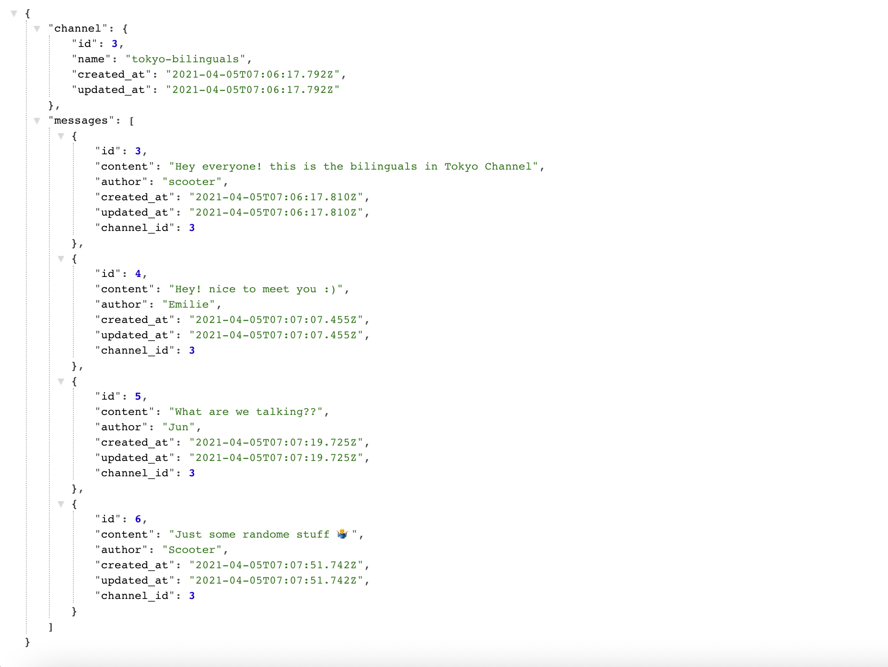
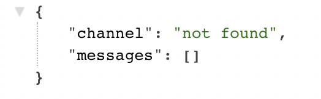
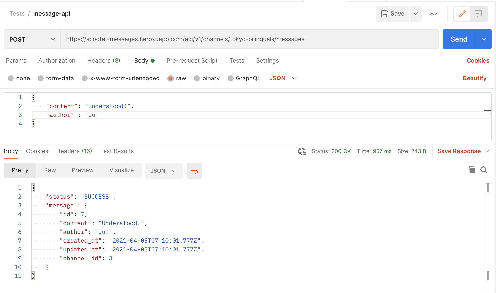
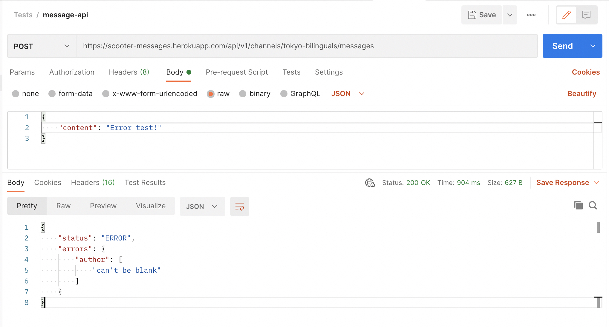
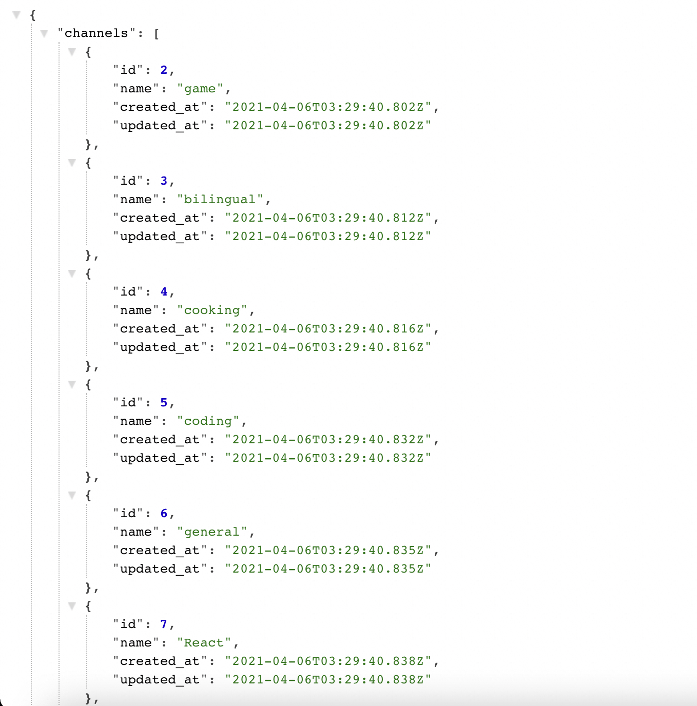

# Welcome to Scooter's message API
This API is a very simple API for messaging among multiple users

## How to use
### How to read the messages
<b>GET `https://scooter-messages.herokuapp.com/api/v1/channels/[CHANNEL_NAME]/messages`</b>
 This would return all the messages in that channel. If the channel name is invalid (do not exist), it would return an error message. 
 ↓example response↓ 

 ↓example response of an invalid request↓ 

### How to send a message
<b>POST `https://scooter-messages.herokuapp.com/api/v1/channels/[CHANNEL_NAME]/messages`</b>
 Attach a body that contains both a "content" and an "author". If either of them are blank, it would return an error message 
 If the post request is routed to a new channel name, it would automatically create a channel with the name in the route. (i.e. If a channel called <em>games</em> never existed in the database, post request to `/api/v1/channels/games/message` will create a new channel called <em>games</em>) 
 ↓refer to the example here in Postman (Successful)↓ 

 ↓refer to the example here in Postman (Unsuccessful)↓ 

### How to see open channels
<b>GET `https://scooter-messages.herokuapp.com/api/v1/channels`</b>
 You can see all available channel names in the database! 
 ↓example response↓ 

